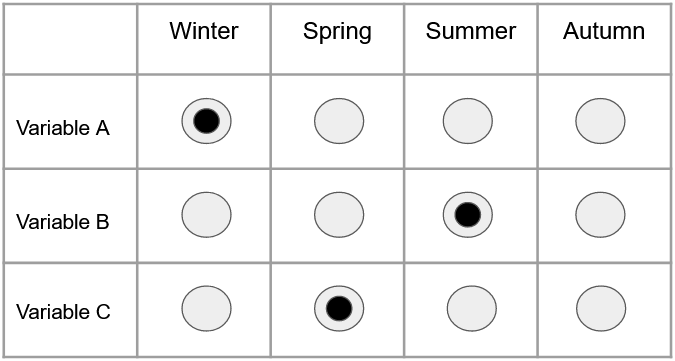

The purpose of this tutorial is to familiarize you with the process of turning an idea into a program.  Something that I personally find amazing about coding is that it allows you to take something hazy and incorporeal like an idea, and turn it into something concrete and functional. One is able to do this by employing something fairly simple in essence (really).  That something is logic of course!  Logic is the universal language within programming, however the local vernacular can vary quite a bit.  And this is the tricky part.  We, as programmers, need to learn how to communicate our logic to the computer using the correct form and syntax.  Ironically, the thing that makes programming so unique and exciting, can also make it frustrating, knowing exactly what you want to say (or write), but not knowing how to say it.

Since this is a shiny course, we will be working through the process we at KDV used to implement a UI element in a web application, though the steps of this procedure should be applicable to most any problem. 

First let's take a look at the broad strokes:

**Step 1:** Do Your Research

The first question you should ask yourself is, 'Is this project *feasible*?'  Go over the constraints you are presented with and weigh the amount of effort required versus the desired result.  'Do I need to create a robust package containing thousands of lines of code so my column header can be purple on one side and green on the other?'  (*Hint*: Probably not).  Chances are you don't need to reinvent the wheel.  That is why it is very important to get online and find out if anyone has solved your problem (or a similar one) already. 

**Important Side Note:** Citations matter in programming too!  If you have found an applicable solution on Stackoverflow, Github, a textbook, or anywhere else, cite that source and author within your code!  Whether you have directly applied their solution to your problem or seeing their solution simply helped you think about your problem in a different way, be on the safe side and **cite it**.

---

**Step 2:** Understand existing examples

Let's say you have miraculously found a chunk of code that solves the exact problem you have been pulling your hair out over for the past hour.  And *somehow*, it even does this in fewer lines than the solution you've been workshopping.  Now all that's left to do is copy and paste it into your own script, change some variable names, and slap a citation on it, right?  No!  My head of department in undergrad called this technique "Cowboy coding" and it was very frowned upon.  But there are more reasons not "Cowboy code" apart from *Dr. Cameron told me not to do it and now I'm telling you not to do it*.  

If you implement code that's doing something and you don't know how, there is a very real possibility that it's not even doing what you think.  And even if it is, there are many more complications that can arise.  As you progress as a progammer and begin writing larger and more complex scripts, understanding your own code will become a serious hurdle.  The function you meticulously and lovingly crafted yesterday evening may look unfamilliar and terrifyingly complex to you the following morning.  Lacking an understanding of your own code *will* lead to problems down the road.

My preferred technique for dissecting another person's code is (if possible) to work on it within a vacuum.  Open an empty script and paste their code into it and experiment as much as possible with different inputs to observe its behavior.  We will go over this in more detail when looking at the code we used!

---

**Step 3:** Identify Necessary Changes

Once you have a solid understanding of what the code you've found is doing and have confirmed it is a viable solution, you need to figure out what you need to do to apply it to your own program.  This step could be very simple or quite complex depending on how well the solution you've found applies to your own problem.  Ask yourself questions like:

"What do I need do to provide this code chunk with properly formatted input?"

"Is the data structure this code creates well suited to my program's logical flow?"

"Should I implement this as an isolated function or within the main logic of my script?"

---

Now that we have covered the general steps, let's begin to explore what we *actually* did.  

Below is a mockup of the visual prompt sent to us by our client.  This element needed to contain a table of buttons.  Each row would represent an output variable which the user could request, and each column would represent a time frame which that output variable should be calculated upon.

{width=50%, height=200pt}

For example, if the user wanted variable **A** calculated over winter, **B** calculated over summer, and **C** calculated over spring, their selections would resemble the following:

{width=50%, height=200pt}


With this prompt in mind, we began to explore the feasibility of this user interface.  We started with a simple Google search, something along the lines of "R shiny table of buttons."  After browsing for a while, we eventually came across the following Stackoverflow [post](https://stackoverflow.com/questions/40661842/radio-buttons-on-shiny-datatable-with-data-frame-data-table).  While the issue this Stackoverflow user was having didn't completely apply to our needs, the example which they based their code on seemed to be a working implementation of the exact user interface element we were trying to create.  

Let's take a look!

```{r radiobutton_Example_Shiny, echo=TRUE}

#Author: Yihui Xie
#License: MIT
#Original Example: https://yihui.shinyapps.io/DT-radio/
#Citation Date: 9/29/2020

library(shiny)
library(DT)
shinyApp(
  ui = fluidPage(
    title = 'Radio buttons in a table',
    DT::dataTableOutput('foo'),
    verbatimTextOutput('sel')
  ),
  server = function(input, output, session) {
    m = matrix(
      as.character(1:5), nrow = 12, ncol = 5, byrow = TRUE,
      dimnames = list(month.abb, LETTERS[1:5])
    )
    for (i in seq_len(nrow(m))) {
      m[i, ] = sprintf(
        '<input type="radio" name="%s" value="%s"/>',
        month.abb[i], m[i, ]
      )
    }
    m
    output$foo = DT::renderDataTable(
      m, escape = FALSE, selection = 'none', server = FALSE,
      options = list(dom = 't', paging = FALSE, ordering = FALSE),
      callback = JS("table.rows().every(function(i, tab, row) {
          var $this = $(this.node());
          $this.attr('id', this.data()[0]);
          $this.addClass('shiny-input-radiogroup');
        });
        Shiny.unbindAll(table.table().node());
        Shiny.bindAll(table.table().node());")
    )
    output$sel = renderPrint({
      str(sapply(month.abb, function(i) input[[i]]))
    })
  }
)

```
*This Shiny app can be found online [here](https://yihui.shinyapps.io/DT-radio/).*

Oof, that is a whole lot of unfamiliar and complex looking code! We thought so too.  So, let me reiterate, you should **not** be able to understand this script simply by looking at it.  I cannot over emphasize that this is not how reading code is supposed to work.  Even veteran software engineers can't simply glance at a chunk of code written by someone else and dictate its behavior. 

The first thing we should do here is try a few inputs to the user interface this code generates.  You should notice fairly quickly that this UI doesn't allow for more than one selection within a single row.  As we see in the title, this is a table of *radio buttons*, the nature of which is to limit the number of selections a user can make to one per a given category.  Take another look at the visual we were to base our user interface from and think about its behavior used a table of radio buttons.  The user would only be able to select one time frame per output variable.

We were uncertain about this stipulation so we contacted our client.  We inquired whether the user should be able to request the same variable over multiple time frames, or if they should be limited to one time frame per variable.  To this question, the answer was the former.  Based on this requirement, it seemed that this code example would not be an exact solution after all.


An important take away from this is that it's important to study code examples from a top level first and progressively examine it at a finer scale as you confirm that it fits your needs.  We were able to learn that this script isn't a precise solution simply by spending a short time exploring its UI.  It would have been easy to immediately jump into this code, try to figure out what the heck "**var $this = $(this.node());**"   means, and go down a rabbit hole of JS callbacks in Shiny; and while that process would unquestionably be valuable in that you'd learn something, it may not be productive towards the current objective.  

Now, based on this new constraint from our client, we decided that a table of checkboxes would be a viable solution.  We likely could have modified the previous example to fit these specifications, but first we returned to Google to search for working implementations.  


After a short time spent searching, we found a potentially viable solution on Stackoverflow.  The original post can be found [here](https://stackoverflow.com/questions/49352886/shiny-r-how-to-save-list-of-checkbox-inputs-from-datatable).

The following code is located at the bottom of the thread titled "Full Example" by Hallie Swan.

```{R shiny_checkbox_post, echo=TRUE}
#Author: Hallie Swan
#Original Post: https://stackoverflow.com/questions/49352886/shiny-r-how-to-save-list-of-checkbox-inputs-from-datatable
#Citation Date: 10/1/2020

library(shiny)
library(DT)

shinyApp(
    ui =
        fluidPage(
            # style modals
            tags$style(
                HTML(
                    ".error {
                    background-color: red;
                    color: white;
                    }
                    .success {
                    background-color: green;
                    color: white;
                    }"
                    )),
            h2("Questions"),
            p("Please check if you enjoy the activity"),
            DT::dataTableOutput('checkbox_table'),
            br(),
            textInput(inputId = "username", label= "Please enter your username"),
            actionButton(inputId = "submit", label= "Submit Form")
        ),

    server = function(input, output, session) {

        # create vector of activities
        answer_options <- c("reading",
                            "swimming",
                            "cooking",
                            "hiking",
                            "binge-watching series",
                            "other")

        ### 1. create a datatable with checkboxes ###
        # taken from https://github.com/rstudio/DT/issues/93/#issuecomment-111001538
        # a) function to create inputs
        shinyInput <- function(FUN, ids, ...) {
            inputs <- NULL
            inputs <- sapply(ids, function(x) {
                inputs[x] <- as.character(FUN(inputId = x, label = NULL, ...))
            })
            inputs
        }
        # b) create dataframe with the checkboxes
        df <- data.frame(
            Activity = answer_options,
            Enjoy = shinyInput(checkboxInput, answer_options),
            stringsAsFactors = FALSE
        )
        # c) create the datatable
        output$checkbox_table <- DT::renderDataTable(
            df,
            server = FALSE, escape = FALSE, selection = 'none',
            rownames = FALSE,
            options = list(
                dom = 't', paging = FALSE, ordering = FALSE,
                preDrawCallback = JS('function() { Shiny.unbindAll(this.api().table().node()); }'),
                drawCallback = JS('function() { Shiny.bindAll(this.api().table().node()); } ')
            )
        )

        ### 2. save rows when user hits submit -- either to new or existing csv ###
        observeEvent(input$submit, {
            # if user has not put in a username, don't add rows and show modal instead
            if(input$username == "") {
                showModal(modalDialog(
                    "Please enter your username first", 
                    easyClose = TRUE,
                    footer = NULL,
                    class = "error"
                ))
            } else {
                responses <- data.frame(user = input$username,
                                        activity = answer_options,
                                        enjoy = sapply(answer_options, function(i) input[[i]], USE.NAMES = FALSE))

                # if file doesn't exist in current wd, col.names = TRUE + append = FALSE
                # if file does exist in current wd, col.names = FALSE + append = TRUE
                if(!file.exists("responses.csv")) {
                    write.table(responses, "responses.csv", 
                                col.names = TRUE, 
                                row.names = FALSE,
                                append = FALSE,
                                sep = ",")
                } else {
                    write.table(responses, "responses.csv", 
                                col.names = FALSE, 
                                row.names = FALSE,
                                append = TRUE, 
                                sep = ",")
                }
                # tell user form was successfully submitted
                showModal(modalDialog("Successfully submitted",
                                      easyClose = TRUE,
                                      footer = NULL,
                                      class = "success")) 
                # reset all checkboxes and username
                sapply(answer_options, function(x) updateCheckboxInput(session, x, value = FALSE))
                updateTextInput(session, "username", value = "")
            }
        })
    }
)
```


We have found another large and complex script which we need to understand.  I'll remind you once again not to panic. Let's start the same way we did last time and take a look at the behavior of the generated UI.  

**Sidenote:** I suggest copying this script and pasting it into a blank .R document of your own, as we will be modifying it as we move forward.

One of the first things you might notice is that there is only one column of checkboxes.  If we are to apply this to our own needs we will have to add three more.  We can also see that, different than the last script, the output is not displayed to the UI.  Other than that there isn't a too much more to glean from the interface itself.  We see that there is a text input to enter a username, and that if it is left blank, we are given a prompt to fill it out.  No big 'Aha!' moments yet, though these small chunks of information represent important pieces of the puzzle, that in its entirety comprises the behavior of this application.

Let's begin to delve into the code itself.  Something we can be thankful for is that the author has added comments throughout their script describing the program's logical flow.  This is almost always worth doing within your own code if there is a chance you may return to it at a later date or you're planning to have anyone else look at it.

To understand this script let's begin by breaking it up into small bite sized pieces and determine what we do understand, and what we don't understand. I generally start within the server portion of shiny apps as this is generally where the core elements of the program are located.
 
The first chunk of code initializes a variable called answer_options.  This appears to be a vector containing the character objects which comprise the row names within the table.  All good so far.

If we pay attention to the author's comments we can see that they have labeled the code used to generate the check box data table.  This logic appears to be contained between lines 37 and 65.  

This section of code is broken up into three sections

**A.** Function to create inputs

**B.** Create dataframe with the checkboxes

**C.** Create the datatable

Section A. contains the definition of the function shinyInput() but my general philosophy when picking apart code is to understand the context from where a function is called prior to understanding the function itself.  So we'll start with section B.
    
    # b) create dataframe with the checkboxes
    df <- data.frame(
      Activity = answer_options,
      Enjoy = shinyInput(checkboxInput, answer_options),
      stringsAsFactors = FALSE
      )

This appears to be a fairly standard data.frame initialization.  df is being initialized with two columns, Activity and Enjoy.  answer_options, the vector containing each row name, is passed to the Activity and the output from the shinyInput() function is passed to Enjoy.  Before moving on, let's think about what we can deduce about ShinyInput() from this code chunk.

+ ShinyInput() returns a vector of the same length as answer_options

+ Since we know the Enjoy column contains the checkboxes, shinyInput() must return a vector of the checkbox objects

+ We pass two arguments to shinyInput
  + reference to the checkboxInput function 
  + answer_options

(**Sidenote:** StringsAsFactors=FALSE simply tells the data.frame to treat Strings as Strings rather than converting them to the Factor data type)


Just by looking at the code around where this function is called, we have deduced what this function does.  Amazing!  There are almost always hints which give us information about the behavior of a function located in the logic around where that function is invoked.  Now we know *what* ShinyInput() does, it's time to figure out *how* it's doing it.  Quickly before moving on, note that two arguments are passed to shinyInput(): a reference to the checkboxInput function and answer_options.

Now, let's return to section A.
  
    # a) function to create inputs
    shinyInput <- function(FUN, ids, ...) {
          inputs <- NULL
          inputs <- sapply(ids, function(x) {
            inputs[x] <- as.character(FUN(inputId = x, label = NULL, ...))
          })
          inputs
    }

The first thing we should note is that the argument titles are FUN and ids.  Since we know that checkboxInput and answer_options were the arguments passed to this function, consider FUN synonymous with checkboxInput and ids synonymous with answer_options.  
The first thing we see is the initialization of the results container, inputs.

Now let's take a look at the logic contained within this function.  We can see that inputs is the variable containing the results, and these resultsa are generated with a call to sapply().

sapply() and really all of the functions within the apply family can seem very odd and confusing.  The form of their calls often contain references to functions or definitions of brand new ones!  Very odd indeed.  But with just a bit of time you will see that they are really quite simple and once you grow comfortable with them they will be a very powerfull tool to have at your disposal.  For the sake of time, we'll just go over sapply, though really they all do very similar things.

sapply takes a vector, X, as the first argument and a function, FUN, as the second.  It returns a vector, the same length as X, each element of which is the result of apply FUN to the corresponding element of X.

This is something more easily understood by example rather than explaination, so take a quick look at the following code:

```{r sapply_example, echo=TRUE}
numbers <- c(1, 2, 3, 4, 5)
numbers_plus_one <- sapply(numbers, function(numbers_at_n){
  numbers_at_n + 1
})
print(numbers_plus_one)

```

So we see that sapply iterates over each element of numbers and passes it to the defined function, hence the argument name numbers_at_n, because we are passing the nth element of vector to the function.  The logic within the function is then applied to the nth element of numbers, and the result is stored within another vector, which is returned once the end of numbers is reached.

Another quick example using a predefined function:

```{r sapply_example2, echo=TRUE}

words <- c("HAT","FAN","DESK","COMPUTER")
words_lower <- sapply(words, tolower)
print(words_lower)

```


Hopefully you now have an understanding of sapply.  Let's delve into the logic of this statement:

    inputs <- sapply(ids, function(x) {
       inputs[x] <- as.character(FUN(inputId = x, label = NULL, ...))
    })


It passes each element of activity_options as the inputId argument of checkboxInput, then converts the returned value of checkboxInput to a vector of characters.

Okay great!  But... why?  Now it seems we must go one level deeper and understand what exactly checkboxInput() returns and why we're converting it to a character vector.

```{r checkboxInput_example, echo=TRUE}
as.character(checkboxInput("hey!", label=NULL))
```

That's HTML!  If we take a glance at the documentation for checkboxInput, (this can be accessed by entering ?checkboxInput into the console), we see that it returns a checkbox structure, represented in HTML, with inputId as the input slot that will be used to access the value of that specific checkbox.  

To drive home this concept, if I just run the following line

```{r checkboxInput_example_2, echo=TRUE}
checkboxInput("hey!", label=NULL)
```

A single checkbox appears!  This is because this document is in and of itself HTML.

So, to put all the pieces together, shinyInput creates a vector, each element of which contains the HTML for a checkbox and each individual checkbox's ID corresponds to an element in activity_options.


