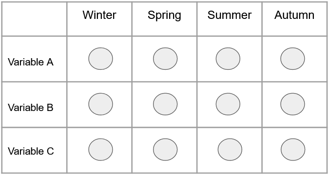
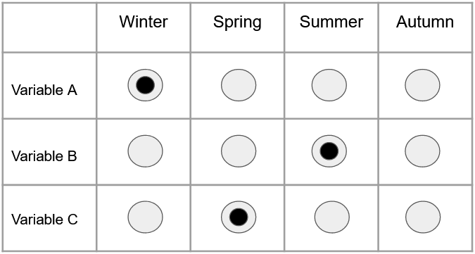

This tutorial, originally written for our R Shiny students, will familiarize you with the process of turning an idea for a novel interactive data visualization concept into working code in a program.  Our students are scientists with good working knowledge of R for their specialized research data visualizations and models but lack foundational knowledge of R or programming.  They have begun to learn R Shiny and have no background in HTML, CSS, or JavaScript.  In class projects they often envision creative and useful, but complex and non-standard, ways to visualize data that they want to implement within a shiny app.

If you just want the working code for our shiny::checkboxInput in a DT::datatable without the walk-through –you can SKIP TO THE END. 

********************************************

Something I personally find amazing about coding is how it allows me to take a hazy and incorporeal idea and code it into something concrete and functional.  A programmer does this by employing something fairly simple in essence (really).  That something is logic, of course!  Logic is the universal language within programming; however, the local vernacular can vary quite a bit.  And this is the tricky part.  A common challenge for new programmers is to learn how to communicate conceptual logic to the computer using the correct form and syntax.  This process of using code to bring data products to life makes programming unique and exciting, but ironically can also make it frustrating.  There are times when you’ll know exactly what you want to say (or write), but not know how to say it. 

At KDV, we have had clients and students present us with some fun data visualization challenges that stretch our R skills.  No one wants a bar plot of fossil frequency when they’ve imagined visualizing the data as a dinosaur silhouette with body parts colored by fossil frequency.  Can this be done in R?  Of course!  Can *we* do this in R?  Sure… with some research and some logic.  More recently, a client requested a web application in which they had imagined a table full of radio buttons as a way for users to select variables by season in a model.  Could it be done?  Of course! Could *we* do it? Likely… we’ve never tried, but it should be possible… 

## Approach

First let's take a look at the broad stroaks to approach a challenge such as this:


**Step 1:** Do Your Research

The first question you should ask yourself is, 'Is this project *feasible*?'  Go over the constraints you are presented with and weigh the amount of effort required versus the desired result.  'Do I need to create a robust package containing thousands of lines of code so my column header can be purple on one side and green on the other?'  (*Hint*: Probably not).  **Chances are you don't need to reinvent the wheel.**  That is why it is important to get online and find out if anyone has solved your problem (or a similar one) already. 

**Important Side Note:** Citations matter in programming too!  If you have found an applicable solution on Stackoverflow, Github, a textbook, or anywhere else, cite that source and author within your code!  Whether you have directly applied their solution to your problem or seeing their solution simply helped you think about your problem in a different way, be on the safe side and **cite it**.

---

**Step 2:** Understand existing examples


Let’s say you have miraculously found a chunk of code that succinctly solves the exact problem you have been pulling your hair out over for the past hour.  Now all that’s left to do is copy and paste it into your own script, change some variables names, and slap a citation on it, right?  No!  This is called “Cowboy coding” and is generally frowned upon. 


**If you implement code that's doing something and you don't know how, there is a very real possibility that it's not even doing what you think.**  Even if it is, lacking an understanding of your own code often leads to problems down the road.

My preferred technique for dissecting another person's code is (if possible) to work on it within a vacuum.  Open an empty script, paste their code into it, and experiment as much as possible with different inputs to observe its behavior.  I'll cover this in more detail when looking at the code example I used!

---

**Step 3:** Identify Necessary Changes

Once you have a solid understanding of the found code’s behavior and have confirmed it will be useful, you need to figure out how to apply it to your own program.  The complexity of this step often depends on how well the solution you’ve found applies to your own problem.  Ask yourself questions like:  

“What do I need to do to provide this code chunk with properly formatted input?” 

“Is the data structure this code creates well suited to my program’s logical flow?” 

“Should I implement this as an isolated function or within the main logic of my script?” 

## Research

Now that I've covered the general approach, let's begin to explore how these steps were applied:


Below is a mockup of the visual prompt sent to KDV by our client.  The client envisioned a table of buttons.  Each row would represent an output variable which the user could request, and each column would represent a time frame upon which that output variable should be calculated.

{width=50%, height=200pt}

For example, if the user wanted variable **A** calculated over winter, **B** calculated over summer, and **C** calculated over spring, their selections would resemble the following:

{width=50%, height=200pt}

## Existing Examples

I had never built anything like this – and recognized it would likely require a nesting collection of radioButton widgets within a DT datatable.  I was uncertain if I could produce this using just R –or if I’d need the help of someone more proficient at JavaScript.  With these thoughts in mind, I began to explore the feasibility of this user interface.  This process started with a simple Google search, something along the lines of “R shiny table of buttons.” After browsing for a while, I eventually came across the following Stackoverflow [post](https://stackoverflow.com/questions/40661842/radio-buttons-on-shiny-datatable-with-data-frame-data-table).  While the issue this Stackoverflow user described didn’t completely apply to my needs, some of the associated example code seemed to be a working implementation of the exact user interface element I was trying to create. 

Let's take a look!


```{r radiobutton_Example_Shiny, echo=TRUE, message=FALSE}

#Author: Yihui Xie
#License: MIT
#Original Example: https://yihui.shinyapps.io/DT-radio/
#Citation Date: 9/29/2020

library(shiny)
library(DT)
shinyApp(
  ui = fluidPage(
    title = 'Radio buttons in a table',
    DT::dataTableOutput('foo'),
    verbatimTextOutput('sel')
  ),
  server = function(input, output, session) {
    m = matrix(
      as.character(1:5), nrow = 12, ncol = 5, byrow = TRUE,
      dimnames = list(month.abb, LETTERS[1:5])
    )
    for (i in seq_len(nrow(m))) {
      m[i, ] = sprintf(
        '<input type="radio" name="%s" value="%s"/>',
        month.abb[i], m[i, ]
      )
    }
    m
    output$foo = DT::renderDataTable(
      m, escape = FALSE, selection = 'none', server = FALSE,
      options = list(dom = 't', paging = FALSE, ordering = FALSE),
      callback = JS("table.rows().every(function(i, tab, row) {
          var $this = $(this.node());
          $this.attr('id', this.data()[0]);
          $this.addClass('shiny-input-radiogroup');
        });
        Shiny.unbindAll(table.table().node());
        Shiny.bindAll(table.table().node());")
    )
    output$sel = renderPrint({
      str(sapply(month.abb, function(i) input[[i]]))
    })
  }
)

```
*This Shiny app can be found online [here](https://yihui.shinyapps.io/DT-radio/).*

*Oof, that includes quite a bit of unfamiliar and complex looking JavaScript code.  I thought so too.  So, let me reiterate, it’s not expected that you understand this script simply by looking at it.  Even veteran software engineers often can’t simply glance at a chunk of code written by someone else and dictate its behavior.*


The first thing we should do here is try a few inputs to the user interface this code generates.  You should notice quickly that this UI doesn’t allow for more than one selection within a single row.  As we see in the title, this is a table of radio buttons, the nature of which is to limit the number of selections a user can make to one per a given category.  Take another look at the visual I was to base this user interface from and think about its behavior if I used a table of radio buttons.  The user would only be able to select one time frame per output variable.  Our client drew and verbally described “radio buttons”, but the sketch also seems to indicate multiple selection should be allowed.  Indeed, when we called our client to clarify, we were able to confirm that the desired behavior would require checkbox inputs rather than radio button inputs.  Thus, this example is not the lucky perfect fit discovery that I had hoped — but it does prove that it is possible to embed input widgets within DT datatable outputs. 

An important insight here:  it is important to study found code examples from a top level down through progressively finer scales as you confirm it fits your needs.  We can quickly determine that this script isn’t a precise solution simply by spending a short time exploring its UI.  By not immediately jumping into this code to try to figure out what the heck "**var $this = $(this.node());**" means, we avoid going down a rabbit hole of JS callbacks in Shiny that might or might not be productive toward the current objective. 

Based on my updated understanding of the client’s request, I returned to Google to search for working implementations of “checkbox in datatable”.  It’s possible that I could have worked from our radioButton example, but why start so far from my end point if there is a closer example out there? 

I found a potentially viable solution on Stackoverflow.  The original post can be found [here](https://stackoverflow.com/questions/49352886/shiny-r-how-to-save-list-of-checkbox-inputs-from-datatable).
 

The following code is located at the bottom of the thread titled “Full Example” by Hallie Swan 

```{R shiny_checkbox_post, echo=TRUE, message=FALSE}
#Author: Hallie Swan
#Original Post: https://stackoverflow.com/questions/49352886/shiny-r-how-to-save-list-of-checkbox-inputs-from-datatable
#Citation Date: 10/1/2020

library(shiny)
library(DT)

shinyApp(
    ui =
        fluidPage(
            # style modals
            tags$style(
                HTML(
                    ".error {
                    background-color: red;
                    color: white;
                    }
                    .success {
                    background-color: green;
                    color: white;
                    }"
                    )),
            h2("Questions"),
            p("Please check if you enjoy the activity"),
            DT::dataTableOutput('checkbox_table'),
            br(),
            textInput(inputId = "username", label= "Please enter your username"),
            actionButton(inputId = "submit", label= "Submit Form")
        ),

    server = function(input, output, session) {

        # create vector of activities
        answer_options <- c("reading",
                            "swimming",
                            "cooking",
                            "hiking",
                            "binge-watching series",
                            "other")

        ### 1. create a datatable with checkboxes ###
        # taken from https://github.com/rstudio/DT/issues/93/#issuecomment-111001538
        # a) function to create inputs
        shinyInput <- function(FUN, ids, ...) {
            inputs <- NULL
            inputs <- sapply(ids, function(x) {
                inputs[x] <- as.character(FUN(inputId = x, label = NULL, ...))
            })
            inputs
        }
        # b) create dataframe with the checkboxes
        df <- data.frame(
            Activity = answer_options,
            Enjoy = shinyInput(checkboxInput, answer_options),
            stringsAsFactors = FALSE
        )
        # c) create the datatable
        output$checkbox_table <- DT::renderDataTable(
            df,
            server = FALSE, escape = FALSE, selection = 'none',
            rownames = FALSE,
            options = list(
                dom = 't', paging = FALSE, ordering = FALSE,
                preDrawCallback = JS('function() { Shiny.unbindAll(this.api().table().node()); }'),
                drawCallback = JS('function() { Shiny.bindAll(this.api().table().node()); } ')
            )
        )

        ### 2. save rows when user hits submit -- either to new or existing csv ###
        observeEvent(input$submit, {
            # if user has not put in a username, don't add rows and show modal instead
            if(input$username == "") {
                showModal(modalDialog(
                    "Please enter your username first", 
                    easyClose = TRUE,
                    footer = NULL,
                    class = "error"
                ))
            } else {
                responses <- data.frame(user = input$username,
                                        activity = answer_options,
                                        enjoy = sapply(answer_options, function(i) input[[i]], USE.NAMES = FALSE))

                # if file doesn't exist in current wd, col.names = TRUE + append = FALSE
                # if file does exist in current wd, col.names = FALSE + append = TRUE
                if(!file.exists("responses.csv")) {
                    write.table(responses, "responses.csv", 
                                col.names = TRUE, 
                                row.names = FALSE,
                                append = FALSE,
                                sep = ",")
                } else {
                    write.table(responses, "responses.csv", 
                                col.names = FALSE, 
                                row.names = FALSE,
                                append = TRUE, 
                                sep = ",")
                }
                # tell user form was successfully submitted
                showModal(modalDialog("Successfully submitted",
                                      easyClose = TRUE,
                                      footer = NULL,
                                      class = "success")) 
                # reset all checkboxes and username
                sapply(answer_options, function(x) updateCheckboxInput(session, x, value = FALSE))
                updateTextInput(session, "username", value = "")
            }
        })
    }
)
```


This example is a large and complex script which I needed to understand if I was going to modify and use it.  I’ll walk you through my process, starting again by looking at the behavior of the generated UI. 

(Sidenote: I suggest copying this script and pasting it into a blank .R document of your own so you can follow along by modifying your own version of the code as we move forward) 

You might immediately notice that there is only one column of checkboxes.  To apply this within the client’s app, I needed to extend this code to create multiple columns.  Unlike the last script, this one does not display any reactive output within the UI.  There is a text input to enter a username, and if it is left blank, you're given a prompt to fill it out.  There isn’t too much more to glean from the interface itself.  no big ‘Aha!’ moments yet, though these small chunks of information represent important pieces of the puzzle. 

## Identifying Changes

Let's begin to delve into the code itself.  Thankfully, the author has added comments throughout their script describing the program's logical flow.  This is almost always worth doing within your own code, especially if there is a chance you may return to it at a later date or you expect someone else to look at it.

To understand this script let's begin by breaking it up into small bite sized pieces.  I usually start within the server portion of shiny apps, where the core elements of the program are located.
 
The first chunk of code initializes an object called answer_options.  This appears to be a vector of character values which become the row names within the table in the application.  If we pay attention to the author’s comments, we can see that they have labeled the code used to generate the checkbox data table, which is contained between lines 37 and 65.  This is the element of this application that is our primary interest and the focus of the rest of this tutorial. 


This section of code is broken up into three parts

**A.** Function to create inputs

**B.** Create dataframe with the checkboxes

**C.** Create the datatable

### Section B

Section A contains the definition of the function shinyInput(), but we are going to start with section B.  My approach when studying someone else's code is to attempt to understand the context where a function is invoked prior to understanding the function itself.

```{r eval=FALSE}
# b) create dataframe with the checkboxes
df <- data.frame(
  Activity = answer_options,
  Enjoy = shinyInput(checkboxInput, answer_options),
  stringsAsFactors = FALSE
  )
```

Apart from the call to ShinyInput() this is a standard data.frame initialization.  The data.frame object df is initialized with two columns, Activity and Enjoy, which we can clearly see correspond to the columns within the UI.  answer_options, the vector containing each row name, is passed to Activity and the output from shinyInput() is passed to Enjoy.  Before moving on, let's consider what we can deduce about ShinyInput() from this data.frame initialization.

+ ShinyInput() likely returns a vector of the same length as answer_options

+ Since we know the Enjoy column contains the checkboxes, shinyInput() must return a vector of the checkbox objects

+ Before moving on, note that two arguments are passed to shinyInput(): a reference to the checkboxInput() function and answer_options. 


(**Sidenote:** StringsAsFactors=FALSE simply tells the data.frame to treat text Strings as data of class character rather than converting them to data of class factor)


*Just by looking at the code around where this function is called, we have deduced what shinyInput() does.  Amazing!  There are almost always hints regarding the behavior of a function located in the code surrounding where that function is invoked.*

### Section A


```{r eval=FALSE}
# a) function to create inputs
shinyInput <- function(FUN, ids, ...) {
      inputs <- NULL
      inputs <- sapply(ids, function(x) {
        inputs[x] <- as.character(FUN(inputId = x, label = NULL, ...))
      })
      inputs
}
```


We can see that the arguments are defined as FUN and ids.  Given checkboxInput and answer_options were the arguments passed to shinyInput(), in that order, we can consider FUN synonymous with checkboxInput and ids synonymous with answer_options.  This function is generating its results via a call to sapply().  sapply() and the other functions within the apply family can seem odd and confusing at first (especially to those more familiar with tidyverse).  The form of their calls often contains references to other functions or definitions of new ones!  They can be useful and are well worth understanding.  For the sake of time we’ll just cover sapply() in this tutorial. 

sapply() takes a vector, *X*, as the first argument and a function, *FUN*, as the second.  It returns a vector, the same length as *X*, each element of which is the result of applying FUN to the corresponding element of *X*.

This is something more easily understood by example rather than explanation though.

```{r sapply_example, echo=TRUE}


numbers <- c("one", "two", "three", "four", "five")
upperNumbers <- sapply(numbers, function(i){
  toupper(i)
})

print(upperNumbers)

```

So, what exactly is happening here?  sapply() is iterating over each element of *numbers*.  Let's say we are currently on the first element, "one,"

+ "one" is passed in as the *i* parameter to the defined function

+ The logic within the function is then applied to "one"

+ The result is then added to a result vector behind the scenes

+ These steps are repeated for each element within *numbers*

+ the result vector is returned once the end of *numbers* has been reached

We can also see that each element within the output vector is named after the input from which it was generated.  This will only be the case with input of type character!

It's also important to note that you can pass references to functions to the FUN argument of sapply().  You don't *have* to define them inline!
```{r eval=FALSE}
sapply(numbers, toupper) 
```

This call to sapply() would perform the same task as previous example.  You may say, "Well why not just do that then? It's clearly more straightforward"  and you would be right. The point is that there may not be a predefined function which contains the logic you need to apply to your vector.

Hopefully you now have a solid grasp on sapply(), so let's delve back into the sapply() call within shinyInput(). 


```{r eval=FALSE}
inputs <- sapply(ids, function(x) {
       inputs[x] <- as.character(FUN(inputId = x, label = NULL, ...))
})
```


Each element of *activity_options* is passed to FUN() as the inputId argument.  It's important to remember that FUN is synonymous with the checkboxInput() function here.  Then checkboxInput() returns a checkbox widget which is represented by a shiny.tag object. That object is then passed to as.character() which converts it to a character vector containing the HTML for that checkbox.

To reiterate, let's say we are on the first element of activity_options, "reading."

+ "reading" is passed to checkboxInput() which returns a checkbox widget with "reading" as its ID

+ the "reading" checkbox is then passed to as.character() which parses the text and returns the raw HTML that represents that checkbox

+ this process is then repeated for each element of answer_options and a vector containing each of these HTML checkboxes is returned

To put all the pieces together, shinyInput() creates a vector, each element of which contains HTML for a checkbox, the ID of which corresponds to an element within activity_options.

Parts A and B of section 1 contain the code to initialize a data.frame called df which is comprised of two columns.  The first column, Activity, holds the names of each possible activity the user may select.  The second column, Enjoy is a vector in which each element contains the HTML for a checkbox.

### Section C

```{r eval=FALSE}
# c) create the datatable
output$checkbox_table <- DT::renderDataTable(
    df,
    server = FALSE, escape = FALSE, selection = 'none',
    rownames = FALSE,
    options = list(
        dom = 't', paging = FALSE, ordering = FALSE,
        preDrawCallback = JS('function() { Shiny.unbindAll(this.api().table().node()); }'),
        drawCallback = JS('function() { Shiny.bindAll(this.api().table().node()); } ')
    )
)
```
     

Section C contains a call to renderDataTable(), the function that takes our data.frame, df, and turns it into the actual UI element displayed in the program.  We aren’t going to go into the meaning of each of the standard arguments, because most are not directly related to the checkbox functionality.  The two lines of interest to us are the lines of javascript passed to preDrawCallback and drawCallback.  These are required when rendering a widget during runtime.  They essentially ‘turn off and on’ each widget within the UI. 

### Output

The last of these core elements that we need to understand before moving on is how the output is handled.  Essentially all code regarding output is encased within an observeEvent() block designed to activate when the user hits the submit button.  A data.frame named responses, initialized on lines 76-78, holds the entered username, activity_options, and the user's selections.  
```{r eval=FALSE}
responses <- data.frame(user = input$username,
                                activity = answer_options,
                                enjoy = sapply(answer_options, function(i) input[[i]], USE.NAMES = FALSE))
```
 
                                
Something useful we learn from this data.frame initialization is how to access the user's selections.  We see that within the assignment of the enjoy column, the user's selections are obtained with a call to sapply().  The function defined within this call to sapply() simply returns input[[i]], where i is an element of answer_options.  Therefore, within the input object, the checkboxes are identified by their corresponding ID within answer_options.  
                                
At lines 82-94 the responses data.frame is written to a file called responses.csv. This file should be in your working directory, if you aren't certain where that is you can enter getwd() into your console to obtain its path.  responses.csv will only be there if you have submitted a response within the program.  Once you have opened responses.csv you can see that the user's choices in the "enjoy" column are represented by a logical, FALSE if unchecked, TRUE if checked.

## Implementing Changes

At this point we have covered the elements of this program that matter to us.  We've explored how these checkboxes were created, how to populate a table with them, and how to access their values within the input object.  Now it's time to begin covering the changes that need to be made within this program for it to fit the user-requirements.  Rather than simply dictating the required changes, I will describe the process that I undertook to modify this script.  This will hopefully display that this is an iterative task.  Rather than a drawing a direct line between the current script and the script we want, this operation is better described by a gradual zigzag, steadily moving towards the desired program.

Before we get too deep into these changes, go ahead and remove the call to p() at line 24, and replace the call to h2() with the following call to h3():

```{r eval=FALSE}
h3("Output Variable Selection")
```

### answer_options and df

The first modifications I made within the server section were to answer_options and df to see how they would affect the dimensions of our table within the UI.  Remember, the user-requirements dictated three rows, each describing a different variable, and four columns which describe a time frame.

answer_options is now initialized as:
```{r eval=FALSE}
answer_options <- c("varA","varB","varC")
```
    
And df as:


```{r eval=FALSE}
df <- data.frame(Variable = answer_options,
                     Spring = shinyInput(checkboxInput, answer_options),
                     Summer = shinyInput(checkboxInput, answer_options),
                     Autumn = shinyInput(checkboxInput, answer_options),
                     Winter = shinyInput(checkboxInput, answer_options))
```
    
    
                  
                     
Go ahead and implement these changes within your own script and run it.

```{r checkbox_mod_1, echo=FALSE}
library(shiny)
library(DT)

shinyApp(
  ui =
    fluidPage(
      # style modals
      tags$style(
        HTML(
          ".error {
                    background-color: red;
                    color: white;
                    }
                    .success {
                    background-color: green;
                    color: white;
                    }"
        )),
      h3("Output Variable Selection"),
      DT::dataTableOutput('checkbox_table'),
      br(),
      textInput(inputId = "username", label= "Please enter your username"),
      actionButton(inputId = "submit", label= "Submit Form")
    ),
  
  server = function(input, output, session) {
    
    # initialize row names
    answer_options <- c("varA",
                        "varB",
                        "varC")
    
    ### 1. create a datatable with checkboxes ###
    # taken from https://github.com/rstudio/DT/issues/93/#issuecomment-111001538
    # a) function to create inputs
    shinyInput <- function(FUN, ids, ...) {
      inputs <- NULL
      inputs <- sapply(ids, function(x) {
        inputs[x] <- as.character(FUN(inputId = x, label = NULL, ...))
      })
      inputs
    }
    
    df <- data.frame(Variable = answer_options,
                     Spring = shinyInput(checkboxInput, answer_options),
                     Summer = shinyInput(checkboxInput, answer_options),
                     Autumn = shinyInput(checkboxInput, answer_options),
                     Winter = shinyInput(checkboxInput, answer_options))
    
  
    # c) create the datatable
    output$checkbox_table <- DT::renderDataTable(
      df,
      server = FALSE, escape = FALSE, selection = 'none',
      rownames = FALSE,
      options = list(
        dom = 't', paging = FALSE, ordering = FALSE,
        preDrawCallback = JS('function() { Shiny.unbindAll(this.api().table().node()); }'),
        drawCallback = JS('function() { Shiny.bindAll(this.api().table().node()); } ')
      )
    )
    
    ### 2. save rows when user hits submit -- either to new or existing csv ###
    observeEvent(input$submit, {
      # if user has not put in a username, don't add rows and show modal instead
      if(input$username == "") {
        showModal(modalDialog(
          "Please enter your username first", 
          easyClose = TRUE,
          footer = NULL,
          class = "error"
        ))
      } else {
        
        
        responses <- data.frame(user = input$username,
                                activity = answer_options,
                                enjoy = sapply(answer_options, function(i) input[[i]], USE.NAMES = FALSE))
        
        # if file doesn't exist in current wd, col.names = TRUE + append = FALSE
        # if file does exist in current wd, col.names = FALSE + append = TRUE
        if(!file.exists("responses.csv")) {
          write.table(responses, "responses.csv", 
                      col.names = TRUE, 
                      row.names = FALSE,
                      append = FALSE,
                      sep = ",")
        } else {
          write.table(responses, "responses.csv", 
                      col.names = FALSE, 
                      row.names = FALSE,
                      append = TRUE, 
                      sep = ",")
        }
        # tell user form was successfully submitted
        showModal(modalDialog("Successfully submitted",
                              easyClose = TRUE,
                              footer = NULL,
                              class = "success")) 
        # reset all checkboxes and username
        sapply(answer_options, function(x) updateCheckboxInput(session, x, value = FALSE))
        updateTextInput(session, "username", value = "")
      }
    })
  }
)

```


This looked fairly promising!  With only a few small edits I was able to get a UI that fit our provided specifications.  However if you submit a response, you'll see that responses.txt still only has one column of logicals.

Perhaps you've already identified the issue in my logic.  If not, take a moment and think about the assignments to df and the shinyInputs() function. 

Remember that shinyInput() uses answer_options to generate IDs for each checkbox.  This process works fine with only a single column of checkboxes, but now there are 4 columns and 3 rows, making a total of 12 checkboxes with only 3 IDs shared between them.  So while it seems like there are 12 checkboxes in this UI, really there are only 3.

### shinyInputs()


To address this, I had to restructure shinyInputs() to ensure each checkbox recieved a unique ID.

I began by adding a vector with the abbreviations of each column name:

```{r eval=FALSE}
column_options <- c("wt","sp","su","at")
```
    
   
Then made the following changes to shinyInput().

```{r eval=FALSE}
shinyInput <- function(FUN, colIds, rowIds, ...){
 inputs <- NULL
 for(rowId in rowIds){
   inputs <- append(inputs,
                  sapply(paste0(rowId,"_",colIds), function(x){
                   as.character(FUN(inputId=x, label=NULL))
                 })
    )
 }
 return(inputs)
}
```

Let's unpack these modifications.  

Now, rather than just passing a single vector containing IDs, we are passing two vectors: rowIds, and colIds.  Then, for each rowId in rowIds, we concatenate rowId with each colId with paste0(), separated with an underscore.  

For the first iteration of rowId, "varA," the resulting vector is:

```{r eval=FALSE}
c("varA_wt", "varA_sp", "varA_su", "varA_at")
```

    
+ This vector is passed to sapply()

+ sapply() passes each element of the vector to checkboxInput()

+ Each resulting checkbox object is then passed to as.character() to obtain the raw HTML

+ These steps are repeated for each rowId to produce a vector of 12 uniquely identified checkboxes represented in HTML


(**Sidenote:** While a different vector is passed to sapply, we are still using the same inline defined function as before.)

With the above changes implemented in shinyInput(), I needed to incorporate the new checkboxes into df, each in the correct column and row location.  I began by storing the results from shinyInput() within a variable called inputs. 

```{r eval=FALSE}
#generate HTML for checkboxes
inputs <- shinyInput(FUN=checkboxInput, colIds=column_options, rowIds=answer_options)
```
    
Next, I selected each individual column of checkboxes by concatenating answer_options with an underscore followed by the season abbreviation for that column.

```{r eval=FALSE}
df <- data.frame(Variables = answer_options,
                 Winter = inputs[paste0(answer_options,"_wt")],
                 Spring = inputs[paste0(answer_options,"_sp")],
                 Summer = inputs[paste0(answer_options,"_su")],
                 Autumn = inputs[paste0(answer_options,"_at")],
                 stringsAsFactors = FALSE)
                 
```

     

If we launch our app now everything seems to work initially. 

```{r checkbox_mod_2, echo=FALSE}
library(shiny)
library(DT)

shinyApp(
  ui =
    fluidPage(
      # style modals
      tags$style(
        HTML(
          ".error {
                    background-color: red;
                    color: white;
                    }
                    .success {
                    background-color: green;
                    color: white;
                    }"
        )),
      h3("Output Variable Selection"),
      DT::dataTableOutput('checkbox_table'),
      br(),
      textInput(inputId = "username", label= "Please enter your username"),
      actionButton(inputId = "submit", label= "Submit Form")
    ),
  
  server = function(input, output, session) {
    
    # create vector of activities
    answer_options <- c("varA",
                        "varB",
                        "varC")
    column_options <- c("wt","sp","su","at")
    
    ### 1. create a datatable with checkboxes ###
    # taken from https://github.com/rstudio/DT/issues/93/#issuecomment-111001538
    # a) function to create inputs
    shinyInput <- function(FUN, colIds, rowIds, ...){
      inputs <- NULL
      for(rowId in rowIds){
        inputs <- append(inputs,
                         sapply(paste0(rowId,"_",colIds), function(x){
                           as.character(FUN(inputId=x, label=NULL))
                         })
        )
      }
      return(inputs)
    }
    inputs <- shinyInput(FUN=checkboxInput, colIds=column_options, rowIds=answer_options)
    
    
    # b) create dataframe with the checkboxes
    df <- data.frame(Variables = answer_options,
                     Winter = inputs[paste0(answer_options,"_wt")],
                     Spring = inputs[paste0(answer_options,"_sp")],
                     Summer = inputs[paste0(answer_options,"_su")],
                     Autumn = inputs[paste0(answer_options,"_at")],
                     stringsAsFactors = FALSE)
    # c) create the datatable
    output$checkbox_table <- DT::renderDataTable(
      df,
      server = FALSE, escape = FALSE, selection = 'none',
      rownames = FALSE,
      options = list(
        dom = 't', paging = FALSE, ordering = FALSE,
        preDrawCallback = JS('function() { Shiny.unbindAll(this.api().table().node()); }'),
        drawCallback = JS('function() { Shiny.bindAll(this.api().table().node()); } ')
      )
    )
    
    ### 2. save rows when user hits submit -- either to new or existing csv ###
    observeEvent(input$submit, {
      # if user has not put in a username, don't add rows and show modal instead
      if(input$username == "") {
        showModal(modalDialog(
          "Please enter your username first", 
          easyClose = TRUE,
          footer = NULL,
          class = "error"
        ))
      } else {
        responses <- data.frame(user = input$username,
                                activity = answer_options,
                                enjoy = sapply(answer_options, function(i) input[[i]], USE.NAMES = FALSE))
        
        # if file doesn't exist in current wd, col.names = TRUE + append = FALSE
        # if file does exist in current wd, col.names = FALSE + append = TRUE
        if(!file.exists("responses.csv")) {
          write.table(responses, "responses.csv", 
                      col.names = TRUE, 
                      row.names = FALSE,
                      append = FALSE,
                      sep = ",")
        } else {
          write.table(responses, "responses.csv", 
                      col.names = FALSE, 
                      row.names = FALSE,
                      append = TRUE, 
                      sep = ",")
        }
        # tell user form was successfully submitted
        showModal(modalDialog("Successfully submitted",
                              easyClose = TRUE,
                              footer = NULL,
                              class = "success")) 
        # reset all checkboxes and username
        sapply(answer_options, function(x) updateCheckboxInput(session, x, value = FALSE))
        updateTextInput(session, "username", value = "")
      }
    })
  }
)
```

However, once you hit submit it immediately crashes and throws an error relating to a data.frame, stating that 'arguments imply differing number of rows.'  Take a moment to think about this.  Based on the behavior of this crash, and the subsequent error message, where might this issue be located?

(*hint:* Think about the modifications we just made to df and the number of checkbox IDs within input. How will these changes affect the latter half of this program?)

That this error only occurs once you press submit is a helpful clue.  This behavior suggests a logical error is almost certainly contained within the observeEvent() block.  Given there is only one data.frame initialization within the observeEvent() block, it’s a fairly safe bet that this error occurs when we initialize the responses data.frame. 

At this point, I had a choice.  I needed to understand (and likely correct) how the user's selections were being saved.  However, where this program sends output to a file — I needed the output to go to a vector (of selected variable for the use in a model).

### Generating Output

Rather than correcting the code that writes responses.txt, I chose to eliminate all code pertaining to username entry and file export.

First, remove all code from within the observeEvent() Block.  Then, remove the textInput() and styleModals() within UI.  The submit button can stay, because the client's app will include a "Run Model" button to perform a similar task.

 

Now, if we run the application and hit submit, nothing happens.  You *could* say we've fixed the error.

```{r checkbox_mod_3, echo=TRUE, message=FALSE}
library(shiny)
library(DT)

shinyApp(
  ui =
    fluidPage(
      # style modals
      h3("Output Variable Selection"),
      DT::dataTableOutput('checkbox_table'),
      br(),
      actionButton(inputId = "submit", label= "Submit Form")
    ),
  
  server = function(input, output, session) {
    
    # create vector of activities
    answer_options <- c("varA",
                        "varB",
                        "varC")
    column_options <- c("wt","sp","su","at")
    
    ### 1. create a datatable with checkboxes ###
    # taken from https://github.com/rstudio/DT/issues/93/#issuecomment-111001538
    # a) function to create inputs
    shinyInput <- function(FUN, colIds, rowIds, ...){
      inputs <- NULL
      for(rowId in rowIds){
        inputs <- append(inputs,
                         sapply(paste0(rowId,"_",colIds), function(x){
                           as.character(FUN(inputId=x, label=NULL))
                         })
        )
      }
      return(inputs)
    }
    inputs <- shinyInput(FUN=checkboxInput, colIds=column_options, rowIds=answer_options)
    
    # b) create dataframe with the checkboxes
    df <- data.frame(Variables = answer_options,
                     Winter = inputs[paste0(answer_options,"_wt")],
                     Spring = inputs[paste0(answer_options,"_sp")],
                     Summer = inputs[paste0(answer_options,"_su")],
                     Autumn = inputs[paste0(answer_options,"_at")],
                     stringsAsFactors = FALSE)
    # c) create the datatable
    output$checkbox_table <- DT::renderDataTable(
      df,
      server = FALSE, escape = FALSE, selection = 'none',
      rownames = FALSE,
      options = list(
        dom = 't', paging = FALSE, ordering = FALSE,
        preDrawCallback = JS('function() { Shiny.unbindAll(this.api().table().node()); }'),
        drawCallback = JS('function() { Shiny.bindAll(this.api().table().node()); } ')
      )
    )
    
    ### 2. save rows when user hits submit -- either to new or existing csv ###
    observeEvent(input$submit, {
      
      
    })
  }
)
```

But there was still an ever-looming question.  Did this work?  I still needed to confirm that the user's selections were being saved correctly following my changes to shinyInput() and df.

Remember, the values of checkboxes can be accessed within input by indexing based on that checkbox ID:
```{r eval=FALSE}
input[["varA_wt"]].
```

Therefore I created a vector called inputNames with the full set of checkbox IDs.

```{r eval=FALSE}
inputNames <- sapply(column_options, function(x){
      paste0(answer_options,"_",x)
    })
```

I then added code within the observeEvent() block to use these IDs to index our input object and obtain the user's selections as well as display them.

I placed the following bit of code at the bottom of the ui:

```{r eval=FALSE}
verbatimTextOutput('selections')
```


and this code chunk within the observeEvent() block:

```{r eval=FALSE}
      #Where input is true for each checkboxID, add checkboxID to selections
      selections <- c()
      for(inputName in inputNames){
        if(input[[inputName]]){
          selections <- append(selections, inputName)
        }
      }
      
     #Display selections to UI
      output$selections <- renderText({
        selections
      })
```


A quick overview of my intent with these additions:

+ Iterate over each *inputName* in *inputNames*

+ If *input* at *inputName* is TRUE (remember checked=TRUE, unchecked=FALSE), add *inputName* to *selections*

+ display *selections*


Below is the code with these modifications. 

```{r checkbox_mod_4, echo=TRUE, message=FALSE}
library(shiny)
library(DT)

shinyApp(
  ui =
    fluidPage(
      # style modals
      h3("Output Variable Selection"),
      DT::dataTableOutput('checkbox_table'),
      br(),
      actionButton(inputId = "submit", label= "Submit Form"),
      verbatimTextOutput('selections')
    ),
  
  server = function(input, output, session) {
    
    # create vector of activities
    answer_options <- c("varA",
                        "varB",
                        "varC")
    column_options <- c("wt","sp","su","at")
    
    ### 1. create a datatable with checkboxes ###
    # taken from https://github.com/rstudio/DT/issues/93/#issuecomment-111001538
    # a) function to create inputs
    shinyInput <- function(FUN, colIds, rowIds, ...){
      inputs <- NULL
      for(rowId in rowIds){
        inputs <- append(inputs,
                         sapply(paste0(rowId,"_",colIds), function(x){
                           as.character(FUN(inputId=x, label=NULL))
                         })
        )
      }
      return(inputs)
    }
    inputs <- shinyInput(FUN=checkboxInput, colIds=column_options, rowIds=answer_options)
    
    # b) create dataframe with the checkboxes
    df <- data.frame(Variables = answer_options,
                     Winter = inputs[paste0(answer_options,"_wt")],
                     Spring = inputs[paste0(answer_options,"_sp")],
                     Summer = inputs[paste0(answer_options,"_su")],
                     Autumn = inputs[paste0(answer_options,"_at")],
                     stringsAsFactors = FALSE)
    # c) create the datatable
    output$checkbox_table <- DT::renderDataTable(
      df,
      server = FALSE, escape = FALSE, selection = 'none',
      rownames = FALSE,
      options = list(
        dom = 't', paging = FALSE, ordering = FALSE,
        preDrawCallback = JS('function() { Shiny.unbindAll(this.api().table().node()); }'),
        drawCallback = JS('function() { Shiny.bindAll(this.api().table().node()); } ')
      )
    )
    
    inputNames <- sapply(column_options, function(x){
      paste0(answer_options,"_",x)
    })
    
    
    ### 2. save rows when user hits submit -- either to new or existing csv ###
    observeEvent(input$submit, {
      
      #Where input is true for each checkboxID, add checkboxID to selections
      selections <- c()
      for(inputName in inputNames){
        if(input[[inputName]]){
          selections <- append(selections, inputName)
        }
      }
      
     #Display selections to UI
      output$selections <- renderText({
        selections
      })
      
    })
  }
)
```


Now when we hit submit the user’s selections are printed to the display and we can easily confirm that checking and unchecking boxes is generating the expected vector of values.

### Formatting

With the desired functionality achieved, my last step was to address the formatting.  This UI element is going to be one component within a larger interface, therefore its width should be scaled down at least a bit. 


I did not anticipate this would be a complex fix, however this became the issue that I spent the most time on.  Googling phrases such as “R Shiny DT Width” gave many tips for adjusting the dimensions of DT datatables, but none of these suggestions were having the desired effect. 

I would pass a width argument to DT::dataTableOutput() and nothing would happen.  So then, I tried passing a width argument to DT::renderDataTable() and still nothing.  I attempted to add structures like fluid columns within the UI and still my simple request for a table width of “50%” yielded no change.  Sometimes the most perplexing error in programming is the lack of one.  No yellow text, no hints to paste into google, just silence and the lack of any notable response. 

Sometimes when making no progress, outside advice is helpful.  A colleague suggested that while the width could be influenced by table scaling — perhaps it was also a function of the cell contents scaling (e.g., the checkboxInput widget).  Then I tried setting the width within the call to checkboxInput() — and it worked!  However, I found that I needed to set the width arguments not only within the call to checkboxInput() but also within DT::dataTableOutput() in the UI.  This is because the table width is limited by input object width, and vice versa; the final size of a table containing other input widgets will depend on both the input object width in checkboxInput() and the table width in dataTableOut(). 

And here it is, the final iteration of our UI element!

```{r checkbox_mod_5, ech0=TRUE, message=FALSE}
library(shiny)
library(DT)

shinyApp(
  ui =
    fluidPage(
      # style modals
      h3("Output Variable Selection"),
      DT::dataTableOutput('checkbox_table',width="50%"),
      br(),
      actionButton(inputId = "submit", label= "Submit Form"),
      verbatimTextOutput('selections')
    ),
  
  server = function(input, output, session) {
    
    # create vector of activities
    answer_options <- c("varA",
                        "varB",
                        "varC")
    column_options <- c("wt","sp","su","at")
    
    ### 1. create a datatable with checkboxes ###
    # taken from https://github.com/rstudio/DT/issues/93/#issuecomment-111001538
    # a) function to create inputs
    shinyInput <- function(FUN, colIds, rowIds, ...){
      inputs <- NULL
      for(rowId in rowIds){
        inputs <- append(inputs,
                         sapply(paste0(rowId,"_",colIds), function(x){
                           as.character(FUN(inputId=x, label=NULL,width="50%"))
                         })
        )
      }
      return(inputs)
    }
    inputs <- shinyInput(FUN=checkboxInput, colIds=column_options, rowIds=answer_options)
    
    # b) create dataframe with the checkboxes
    df <- data.frame(Variables = answer_options,
                     Winter = inputs[paste0(answer_options,"_wt")],
                     Spring = inputs[paste0(answer_options,"_sp")],
                     Summer = inputs[paste0(answer_options,"_su")],
                     Autumn = inputs[paste0(answer_options,"_at")],
                     stringsAsFactors = FALSE)
    # c) create the datatable
    output$checkbox_table <- DT::renderDataTable(
      df,
      server = FALSE, escape = FALSE, selection = 'none',
      rownames = FALSE,
      options = list(
        dom = 't', paging = FALSE, ordering = FALSE,
        preDrawCallback = JS('function() { Shiny.unbindAll(this.api().table().node()); }'),
        drawCallback = JS('function() { Shiny.bindAll(this.api().table().node()); } ')
      )
    )
    
    inputNames <- sapply(column_options, function(x){
      paste0(answer_options,"_",x)
    })
    
    
    ### 2. save rows when user hits submit -- either to new or existing csv ###
    observeEvent(input$submit, {
      selections <- c()
      
      for(inputName in inputNames){
        if(input[[inputName]]){
          selections <- append(selections, inputName)
        }
      }
      
     # print(selections)
      output$selections <- renderText({
        selections
      })
      
    })
  }
)
```

*I hope you have found this tutorial useful as a walk-through of the logic I use to breakdown a novel problem and apply logic to find, understand, modify, and test code resources I find online.  For our students, this is a familiar process of reasoning within their specialized research field —but it is often not a familiar process with code.  While you may be excited to make a table of checkboxes, my ultimate goal is to help you gain confidence when designing your application and addressing the inevitable errors and complications that arise in development.  Remember, never be afraid to Google, us ? To view documentation in RStudio, ask a colleague, and do your best not to panic.*